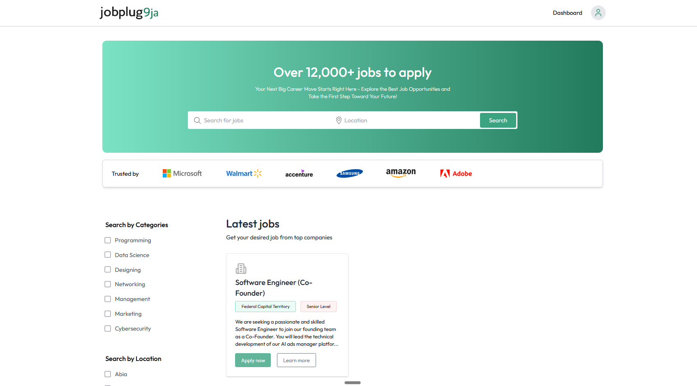
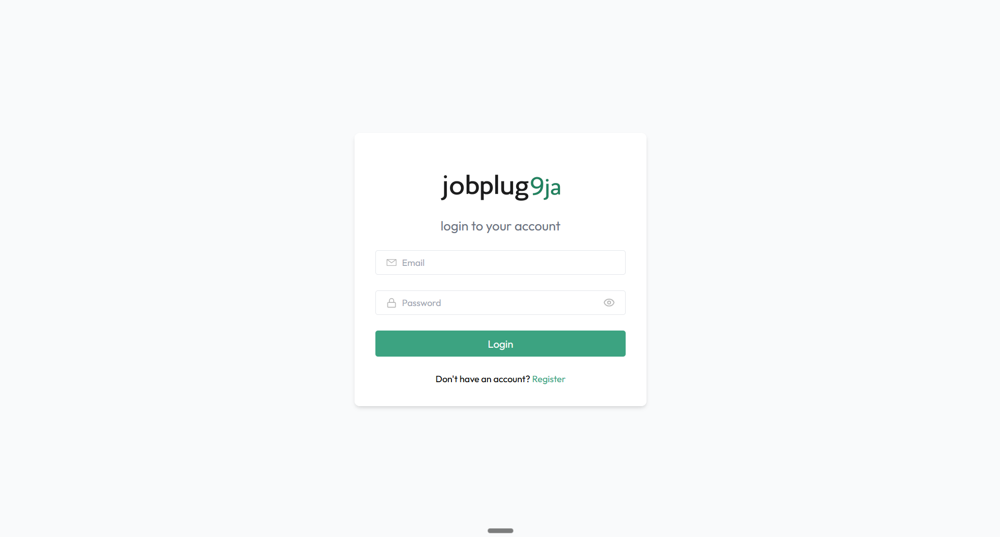
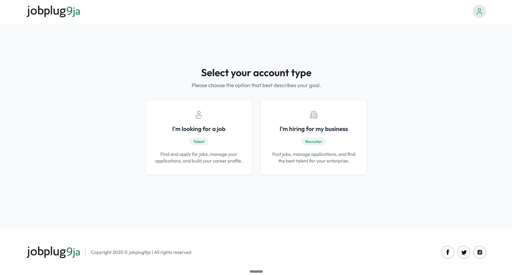
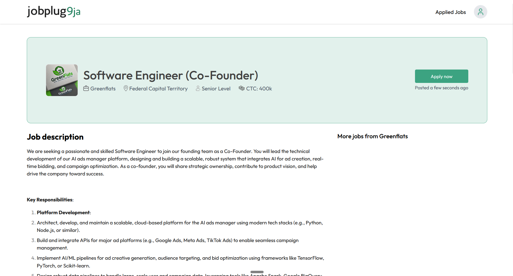
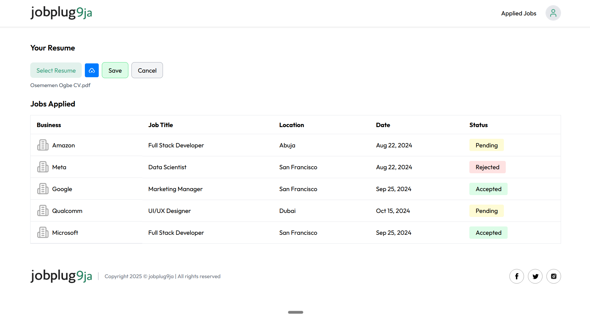
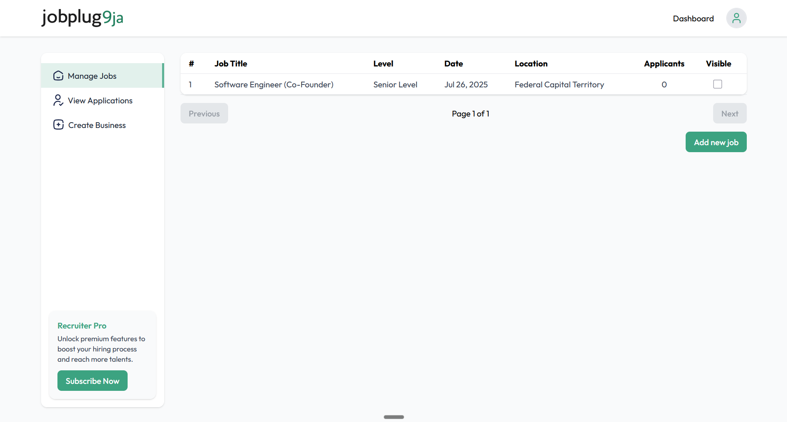

# jobplug9ja

This repository contains a full-stack job portal application with a Node.js API and a React client. Below are the setup instructions for both the API and client.

## Prerequisites

Ensure you have the following installed on your system:

- [Node.js](https://nodejs.org/) (v20 or later)
- [npm](https://www.npmjs.com/) or [yarn](https://yarnpkg.com/)
- [MongoDB](https://www.mongodb.com/) (for the database)

## Environment Variables

Create a `.env` file in the `api` directory and configure the required environment variables.

### API Environment Variables

- `PORT`: The port on which the API server will run (default: `3000`).
- `NODE_ENV`: The environment (`development`, `production`, etc.).
- `DATABASE_URL`: The connection string for your MongoDB database. Fetch this from your MongoDB Atlas dashboard.
- `JWT_ACCESS_SECRET`: Secret key for JWT access tokens.
- `JWT_REFRESH_SECRET`: Secret key for JWT refresh tokens.
- `ACCESS_TOKEN_EXPIRY`: Expiry time for access tokens.
- `REFRESH_TOKEN_EXPIRY`: Expiry time for refresh tokens.
- `CLOUDINARY_CLOUD_NAME`: Cloudinary cloud name.
- `CLOUDINARY_API_KEY`: Cloudinary API key.
- `CLOUDINARY_API_SECRET`: Cloudinary API secret.
- `STORAGE_PROVIDER`: Storage provider (default: `cloudinary`).

## Setup Instructions

### API Setup

1. Navigate to the `api` directory:

   ```bash
   cd api
   ```

2. Install dependencies:

   ```bash
   npm install
   ```

3. Set up the database using Prisma:

   ```bash
   npx prisma db push
   ```

4. Start the development server:

   ```bash
   npm run dev
   ```

   The API server should now be running on `http://localhost:3000` (or the port specified in your `.env` file).

### Client Setup

1. Navigate to the `client` directory:

   ```bash
   cd client
   ```

2. Install dependencies:

   ```bash
   npm install
   ```

3. Start the development server:

   ```bash
   npm run dev
   ```

   The client should now be running on `http://localhost:5173` (or the port specified in your `.env` file).

## Additional Notes

- Ensure the API server is running before using the client.
- Use `npm run build` in the `client` directory to create a production build of the client.
- Use `npm run preview` in the `client` directory to preview the production build.

## Screenshots

Here are some screenshots of the application:

### Home Page



### Login Page



### Select Account Type Page



### View Job Page



### Applied Jobs Page



### Recruiter Dashboard Page



## License

This project is licensed under the Apache-2.0 License. See the `LICENSE` file for details.
